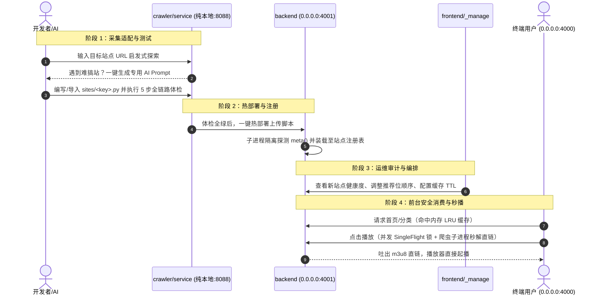

# Plove 影视聚合系统 —— 新人全链路接手指南

欢迎加入 Plove 项目团队！本文档专为新同事快速理解系统全貌、熟悉目录边界、掌握“爬虫 ➔ 后端 ➔ 前端”的核心运行链路而编写。

---

## 目录规范与职责边界

项目严格遵循**四大根目录规范**，没有任何多余的杂乱文件夹，职责边界划分清晰明确：

```text
Plove1.0/
├── frontend/             # 前端工程（Vue 3 + Vite + Vant + Element Plus）
│   ├── src/              # 用户移动端 + 后台控制台全套源码
│   ├── vite.config.ts    # 监听 0.0.0.0:4000，反代 /api 至后端 4001
│   └── .env              # 前端环境配置（含 VITE_ADMIN_PATH 安全入口）
│
├── backend/              # 后端核心微服务（FastAPI + SQLAlchemy + Pydantic v2）
│   ├── app/              # 核心业务：网关、爬虫进程调度、单飞并发控制、防穿透缓存、激活码
│   ├── contracts/        # 统一跨端 JSON Schema 契约定义
│   ├── data/             # 图片防盗链缓存本地存储（img_cache）
│   └── tests/            # 296+ 自动化单元与集成测试套件
│
├── crawler/              # 爬虫与自动化工坊（SDK + 站点集 + 独立控制台）
│   ├── crawler_kit/      # 爬虫基础工具箱（零第三方大依赖，含 Client/parse/clean/cli）
│   ├── sites/            # 单文件采集器库（ai2048, ncat21, xiaoyakankan 等）
│   └── service/          # 爬虫独立微服务与 Web 智能工坊（纯本地 127.0.0.1:8088）
│
├── docs/                 # 统一设计与运维文档中心
│   ├── architecture.md   # 系统整体架构深度解析
│   ├── deploy/           # 生产部署规范（宝塔面板、Nginx 反代、Systemd 服务）
│   └── ui_design/        # 官方奈飞级 1:1 视觉规范与原型资源
│
├── .gitignore            # Git 忽略配置
└── README.md             # 本接手指南
```

---

## 核心业务链路：从爬虫到前端呈现

项目最核心的商业闭环是**“爬虫 ➔ 后端 ➔ 前端”**的高效流转，整体链路分为以下 5 个关键阶段：



### 1. 爬虫开发与工坊体检（crawler/）
- **通用站点**：在纯本地爬虫控制台（`http://127.0.0.1:8088/`）输入目标 URL，引擎自动挖掘导航分类、首页卡片并生成基准代码。
- **高难度站点**：
  - 点击【🤖 难搞站点？一键生成交付给 AI 的提示词 (Prompt)】；
  - 将生成的专业 Prompt 发给 AI（ChatGPT/DeepSeek/Claude 等）；
  - 将 AI 编写的代码贴入【🧪 外部脚本导入与全链路测试工坊】；
  - 必须通过 **5 步递进式自动化体检**（AST 安全审计 ➔ meta 冒烟 ➔ home 分类与推荐 ➔ detail 详情穿透 ➔ play 直链嗅探）。

### 2. 热部署上传至后端（crawler ➔ backend）
- 在体检 5 项全绿后，点击【🚀 上传并部署至后端】；
- 爬虫工坊调用后端 `/api/v1/admin/crawlers/upload` 接口；
- 后端在严格受限的独立子进程中进行二次审计与 `meta()` 冒烟测试；
- 验证通过后自动写入 `crawler/sites/<key>.py` 并触发注册表热重载，**完全无需重启后端进程**。

### 3. 后端治理与安全调度（backend/）
- **SingleFlight 防击穿**：相同剧集播放地址并发请求时，合并为一个子进程执行，防止打满源站；
- **两级限流与熔断**：单站并发上限 2，全站并发上限 4；连续失败 5 次自动触发熔断冷却，防止拖垮服务器；
- **智能 LRU 缓存**：分类列表与影片详情按 TTL 自动缓存，播放直链永不缓存保证时效。

### 4. 前台呈现与安全控制台（frontend/）
- **终端用户端**：访问 `http://<ip>:4000/`，凭激活码完成设备绑定后即可流畅浏览与播放；
- **运维控制台**：访问安全隐蔽路径（如 `http://<ip>:4000/_manage/login`），可对内容源进行启停、优先级排序、缓存预热、分类重命名与子分类显隐控制、发码运维。

### 5. 两级分类与胶囊筛选栏（Subcategories）
- **树形层级设计**：爬虫规范化输出一级大类（电影、连续剧、综艺、动漫等）与对应的二级子分类（全部、动作片、喜剧片等）；
- **胶囊筛选栏 (Pill Filters)**：前台分类页顶部自动渲染微交互药丸胶囊筛选条，实现即点即滤；
- **重命名展示格式规范**：
  - 未重命名：直接展示分类原名，例如 `电影`；
  - 设置别名（如“你好”）：前台自动展示为 `原名（别名）`，例如 `电影（你好）`，系统内置多余括号清洗与幂等保护；
- **交互式显隐控制**：
  - 后台二级分类胶囊点击一下**变红即隐藏**（`[已隐藏]` 标记），再次点击恢复正常展示，无需通过删除来实现隐藏；
  - 隐藏的二级分类在前台自动过滤不渲染，直接通过 URL 请求也会被后端 403 严格拦截。

---

## 端口与网络监听拓扑

| 服务名称 | 监听绑定 | 访问地址 | 架构说明与功能 |
| :--- | :--- | :--- | :--- |
| **服务总控中转导航 (Portal)** | `0.0.0.0:4001` | `http://<ip>:4001/` | **全套服务直达中心**：带密码防护，一屏聚合前端、后台、爬虫工坊及全部 API 文档 |
| **前端用户端 (Frontend)** | `0.0.0.0:4000` | `http://<ip>:4000/` | 面向终端用户播放；所有 `/api/*` 请求由 Vite 代理转送给后端 |
| **安全运维控制台 (Manage)** | `0.0.0.0:4000` | `http://<ip>:4000/_manage` | 安全混淆入口；支持分类治理、牛皮癣广告清洗、脚本热重载、激活码发码 |
| **后端核心 API (Backend)** | `0.0.0.0:4001` | `http://<ip>:4001/api/v1` | 业务核心；交互文档直达 `http://<ip>:4001/docs` |
| **爬虫工坊与控制台 (Crawler)** | `127.0.0.1:8088` | `http://127.0.0.1:8088/` | **仅限纯本地访问**；含 5 步递进全链路体检，API 文档位于 `:8088/docs#/` |

---

## 关键安全机制说明

### 1. 为什么不用常见的 `/admin` 路径？
- 公网上的撞库与扫描机器人时刻盯着 `/admin` 路径进行暴力破解；
- 项目在 [frontend/.env](file:///e:/Pychon-code/NY/Plove1.0/frontend/.env) 中采用 `VITE_ADMIN_PATH` 配置安全路径（默认 `/_manage`，生产可改为更复杂的自定义路径）；
- **蜜罐防御**：外部如果直接访问 `/admin`，系统会自动静默拦截并重定向到用户端首页，对外完全隐藏后台的存在。

### 2. 爬虫脚本合规硬红线
爬虫脚本在运行与上传时均受到严格的 AST 静态语法审查：
- **零外部大依赖**：只允许 `import crawler_kit` 与 Python 标准库（如 `re`, `json`, `urllib`），禁止 `requests`, `scrapy`, `selenium` 等；
- **严禁高危操作**：禁止 `subprocess`, `ctypes`, `socket`, `eval`, `exec`, `os.system`；
- **统一信封通信**：子进程 stdout **只能输出单行合法 JSON 信封**（`{"ok": true, "data": ...}`），所有调试日志一律走 stderr。
- **一键推送体检**：爬虫工坊支持源码一键调入体检工坊并热重载至后端，无需手动重启。

---

## 5 分钟本地极速起跑

### 1. 启动后端服务 (4001)
```powershell
# 在 backend 目录下使用虚拟环境启动
cd backend
.\.venv\Scripts\python.exe -m uvicorn app.main:app --host 0.0.0.0 --port 4001
```
> 健康检查接口：`http://127.0.0.1:4001/api/v1/health`

### 2. 启动前端服务 (4000)
```powershell
# 在 frontend 目录下启动
cd frontend
npm run dev
```
> 前台访问地址：`http://127.0.0.1:4000/`  
> 安全后台登录：`http://127.0.0.1:4000/_manage/login`（默认 Token：`admin`）

### 3. 启动爬虫工坊 (纯本地 8088)
```powershell
# 在根目录下启动爬虫本地微服务
cd ..
.\backend\.venv\Scripts\python.exe -m uvicorn crawler.service.main:app --host 127.0.0.1 --port 8088
```
> 爬虫 Web 控制台：`http://127.0.0.1:8088/`

---

## 常用测试与质量验证

```powershell
# 运行后端全量 296+ 测试套件
cd backend
.\.venv\Scripts\python.exe -m pytest

# 运行爬虫服务单元测试
cd ..
.\backend\.venv\Scripts\python.exe -m pytest crawler/service/tests

# 运行前端 TypeScript 强类型检查
cd frontend
cmd.exe /c "npm run typecheck"
```

祝您开发愉快！如有任何架构细节疑问，欢迎查阅 [docs/architecture.md](file:///e:/Pychon-code/NY/Plove1.0/docs/architecture.md) 或联系核心团队成员。
